# 🎬 TIA-SALES: Complete Video Production Masterclass

## 📋 VIDEO SPECIFICATIONS
- **Duration:** 90 seconds (1:30)
- **Resolution:** 1920x1080 (16:9)
- **Frame Rate:** 30 FPS
- **Style:** Canvas-based animation explainer

***

## 🎯 COMPLETE SCENE-BY-SCENE BREAKDOWN

### **PART 1: MASTER TIMELINE TABLE**

| Timestamp | Transcript (Audio) | Visual Content / Action | CapCut Instruction & Shortcuts |
|:----------|:-------------------|:------------------------|:-------------------------------|
| **SCENE 1: OPENING (0:00.00 - 0:08.00)** | | | |
| 0:00.00 - 0:00.50 | [Silence with music fade-in] | Black screen → Fade to dark blue gradient (#0f172a) | |
| 0:00.50 - 0:01.00 | [Music swells] | Animated particles moving across screen (tech aesthetic) | |
| 0:01.00 - 0:02.50 | "Introducing TIA-Sales..." | **TIA-SALES** logo appears center (scale from 0% to 100% in 0.8s) <br> Font: Bold Sans, Size: 120pt, Color: #38bdf8 | |
| 0:02.50 - 0:04.00 | "...the first AI-powered..." | Subtitle appears below: "The Agentic AI Sales Channel" <br> Font: Light Sans, 48pt, White (#ffffff) | |
| 0:04.00 - 0:06.50 | "...autonomous sales channel that converts digital interest..." | Small badge appears bottom-right: "EY Techathon 6.0" <br> Shape: Rounded rectangle, Gold (#FFB400) | |
| 0:06.50 - 0:08.00 | "...into instant loan sanctions." | Add team name: "Team: mishranitin6076" (bottom, small, 24pt) | |
| **SCENE 2: THE PROBLEM (0:08.00 - 0:22.00)** | | | |
| 0:08.00 - 0:08.50 | [Transition sound effect] | Entire screen wipes right, revealing white background | |
| 0:08.50 - 0:10.00 | "Traditional loan origination is broken." | Heading appears top: "THE PROBLEM" <br> Font: Bold, 72pt, Red (#ef4444) <br> Background: Light gray (#f1f5f9) | |
| 0:10.00 - 0:10.50 | [Pause for emphasis] | Animated hourglass icon (⏳) appears center-left | |
| 0:10.50 - 0:13.00 | "It takes three to seven days..." | Large text appears: **"3-7 DAYS"** <br> Font: 96pt, Bold, Red <br> Number counts up from 0 to 7 | |
| 0:13.00 - 0:15.50 | "...with eighty-two percent customer drop-off..." | Split screen: Left shows "3-7 DAYS", Right shows new content <br> Right side: **"82% DROP-OFF"** with downward arrow (↓) | |
| 0:15.50 - 0:18.00 | "...costing NBFCs like Tata Capital..." | Tata Capital logo appears center (if available) <br> OR text: "NBFCs like Tata Capital" with building icon (🏢) | |
| 0:18.00 - 0:22.00 | "...over five hundred crores in lost revenue annually." | All previous elements shrink and move to corners <br> Center: **"₹500+ CR LOST"** (huge, pulsating) <br> Color: Dark red, Bold, 108pt | |
| **SCENE 3: THE SOLUTION (0:22.00 - 0:38.00)** | | | |
| 0:22.00 - 0:22.50 | [Uplifting music transition] | Screen wipes to blue theme (#38bdf8 gradient) | |
| 0:22.50 - 0:24.50 | "TIA-Sales changes everything." | TIA-SALES logo returns (smaller, top-left corner) <br> Heading center: "THE SOLUTION" (White, 72pt) | |
| 0:24.50 - 0:27.50 | "It's an AI-powered conversational assistant..." | Chat interface mockup slides in from right <br> Shows: Mobile phone frame with chat bubbles | |
| 0:27.50 - 0:31.00 | "...that handles the entire end-to-end loan journey..." | 4 stages appear sequentially below phone: <br> 1️⃣ Consent → 2️⃣ KYC → 3️⃣ Docs → 4️⃣ Decision | |
| 0:31.00 - 0:34.00 | "...from initial chat to final sanction letter..." | PDF document icon (📄) appears right side with glow effect | |
| 0:34.00 - 0:38.00 | "...in under five minutes, twenty-four-seven, with zero manual work." | Comparison numbers appear: <br> **"7 DAYS → 5 MIN"** (center, large) <br> Below: "24/7" + "0 Manual Work" | |
| **SCENE 4: ARCHITECTURE (0:38.00 - 1:08.00)** | | | |
| 0:38.00 - 0:40.00 | "Here's how it works architecturally." | Clean canvas: White background <br> Title: "SYSTEM ARCHITECTURE" (top, 64pt) | |
| 0:40.00 - 0:43.00 | "Customer inputs arrive at our FastAPI backend..." | **LAYER 1:** Customer icon (👤) connects to FastAPI box | |
| 0:43.00 - 0:47.00 | "...which routes intent through a semantic classifier to the Master Agent." | **LAYER 2:** FastAPI → Semantic Router → Master Agent (connected with arrows) | |
| 0:47.00 - 0:52.00 | "The Master Agent orchestrates four specialized workers: Consent, KYC, Document OCR, and Underwriting." | **LAYER 3:** 4 worker boxes appear below Master Agent (Consent, KYC, Document, Underwriting) | |
| 0:52.00 - 0:56.00 | "Each agent reads and writes to Redis for session state..." | **LAYER 4:** Redis cache box appears with dotted lines connecting to workers | |
| 0:56.00 - 1:00.00 | "...and logs every action immutably to MySQL for RBI compliance." | **LAYER 5:** MySQL database box appears with solid lines from workers | |
| 1:00.00 - 1:04.00 | "The Underwriting Agent applies fifteen deterministic credit rules..." | Underwriting Agent box glows and displays "15 Rules" badge | |
| 1:04.00 - 1:08.00 | "...then generates a digitally signed PDF sanction letter." | PDF icon appears at bottom-center with sparkle effects | |
| **SCENE 5: LIVE FLOW (1:08.00 - 1:20.00)** | | | |
| 1:08.00 - 1:08.50 | "Let me show you a live flow." | Chat interface appears with empty chat window | |
| 1:08.50 - 1:10.00 | "Customer says: I need a five lakh loan." | User message bubble appears (bottom-left): "Hi, I need a ₹5L loan" | |
| 1:10.00 - 1:12.00 | "TIA-Sales responds instantly, requesting consent." | Bot message appears (bottom-right): "I can help! First, I need your consent..." | |
| 1:12.00 - 1:13.50 | "Customer agrees. Consent is recorded with timestamp." | User: "Yes, I agree" <br> Bot: "✓ Consent recorded - 2:34 PM" | |
| 1:13.50 - 1:15.50 | "Customer provides their Customer ID. Verified in real-time." | User: "CUST123456" <br> Bot: "✓ Verified! Loan amount?" | |
| 1:15.50 - 1:17.00 | "Loan amount confirmed. Documents requested." | User: "₹5 lakhs" <br> Bot: "Perfect! Please upload: Salary slip & PAN card" | |
| 1:17.00 - 1:18.50 | "Customer uploads documents. OCR extracts data..." | Upload animation with progress bar (0% → 98%) <br> Bot: "Processing... 98% confidence" | |
| 1:18.50 - 1:20.00 | "...with ninety-eight percent confidence." | Extracted data preview with checkmarks | |
| **SCENE 6: IMPACT (1:20.00 - 1:30.00)** | | | |
| 1:20.00 - 1:20.50 | [Music builds] | Chat slides out, comparison table slides in | |
| 1:20.50 - 1:22.00 | "The impact is massive." | Heading: "THE IMPACT" (bold, 72pt, blue) | |
| 1:22.00 - 1:24.00 | "Processing time drops from seven days to five minutes." | Table row 1: "TAT: 7 days → 5 min" | |
| 1:24.00 - 1:26.00 | "Conversion rate doubles from thirty-seven to seventy-five percent." | Table row 2: "Conversion: 37% → 75%" with "+103%" badge | |
| 1:26.00 - 1:27.50 | "Cost per loan reduced by ninety-five percent." | Table row 3: "Cost/Loan: ₹850 → ₹45" with "-95%" badge | |
| 1:27.50 - 1:30.00 | "That's sixteen hundred and ten crores in additional revenue annually." | Center screen: **"₹1,610 CR"** <br> Below: "Annual Revenue Impact" | |
| **SCENE 7: CLOSING (1:30.00)** | | | |
| 1:30.00 | [Music outro] | TIA-SALES logo center <br> "Ready for Production" <br> "Team: mishranitin6076" <br> "github.com/mishranitin6076/TIA-Sales" | |

***

## 🎨 ASSET CREATION SECTION

### **1. MERMAID DIAGRAMS (Export as PNG from mermaid.live)**

#### **DIAGRAM A: Architecture Layer 1 (Customer → FastAPI)**

```mermaid
graph LR
    A["👤 Customer<br/>Chat Input"]
    B["⚙️ FastAPI<br/>Backend Server"]
    
    A -->|"REST API<br/>HTTPS"| B
    
    style A fill:#38bdf8,stroke:#0f172a,stroke-width:3px,color:#fff
    style B fill:#0284c7,stroke:#0f172a,stroke-width:3px,color:#fff
```


#### **DIAGRAM B: Architecture Layer 2 (Add Router & Master)**

```mermaid
graph LR
    B["⚙️ FastAPI"]
    C["🔀 Semantic<br/>Router<br/>(Intent Classification)"]
    D["🧠 Master Agent<br/>(Orchestrator)"]
    
    B -->|"User Input"| C
    C -->|"Route Task"| D
    
    style B fill:#0284c7,stroke:#0f172a,stroke-width:2px,color:#fff
    style C fill:#8b5cf6,stroke:#0f172a,stroke-width:2px,color:#fff
    style D fill:#FFB400,stroke:#0f172a,stroke-width:3px,color:#000
```


#### **DIAGRAM C: Architecture Layer 3 (Worker Agents)**

```mermaid
graph TB
    MASTER["🧠 Master Agent"]
    
    W1["✍️ Consent Agent<br/>Legal Compliance"]
    W2["🆔 KYC Agent<br/>Verification"]
    W3["📄 Document Agent<br/>OCR Processing"]
    W4["⚖️ Underwriting Agent<br/>Credit Rules (15)"]
    
    MASTER -->|"Delegate 1"| W1
    MASTER -->|"Delegate 2"| W2
    MASTER -->|"Delegate 3"| W3
    MASTER -->|"Delegate 4"| W4
    
    style MASTER fill:#FFB400,stroke:#0f172a,stroke-width:3px,color:#000
    style W1 fill:#10b981,stroke:#0f172a,stroke-width:2px,color:#fff
    style W2 fill:#10b981,stroke:#0f172a,stroke-width:2px,color:#fff
    style W3 fill:#10b981,stroke:#0f172a,stroke-width:2px,color:#fff
    style W4 fill:#10b981,stroke:#0f172a,stroke-width:2px,color:#fff
```


#### **DIAGRAM D: Architecture Layer 4 (Data Storage)**

```mermaid
graph TB
    WORKERS["Worker Agents<br/>4 Specialized Units"]
    
    REDIS["⚡ Redis Cache<br/>Session State<br/>(Real-time)"]
    MYSQL["🗄️ MySQL Database<br/>Audit Trail<br/>(Immutable)"]
    
    WORKERS -.->|"Read/Write<br/>Session Data"| REDIS
    WORKERS -->|"Log All Actions<br/>Compliance"| MYSQL
    
    style WORKERS fill:#10b981,stroke:#0f172a,stroke-width:2px,color:#fff
    style REDIS fill:#ef4444,stroke:#0f172a,stroke-width:2px,color:#fff
    style MYSQL fill:#6366f1,stroke:#0f172a,stroke-width:2px,color:#fff
```


#### **DIAGRAM E: Complete Architecture (All Layers Combined)**


**Export Instructions:**
1. Go to **https://mermaid.live/**
2. Paste each code block
3. Click **"Actions"** → **"PNG"** → **1920x1080 resolution**
4. Download and rename (e.g., `arch_layer1.png`)
5. Import to CapCut media library

***

### **2. AI IMAGE GENERATION PROMPTS** (Use Leonardo.ai, Midjourney, or DALL-E)

#### **PROMPT 1: Hero Background (Scene 1)**
```
Professional tech background, dark blue gradient (#0f172a to #1e293b), subtle geometric patterns, floating particles, depth of field, cinematic lighting, 4K, ultra HD, corporate modern aesthetic, minimalist, no text
```

#### **PROMPT 2: Problem Visualization (Scene 2)**
```
Isometric illustration of frustrated business people waiting in a queue, holding documents, hourglass symbols floating, red warning symbols, broken conveyor belt system, corporate office setting, flat design, red and gray color palette, top-down view
```

#### **PROMPT 3: AI Brain Network (Scene 3)**
```
Abstract neural network visualization, blue and gold glowing nodes connected with data streams, central AI brain hub, holographic interface elements, futuristic HUD design, cyber aesthetic, tron-like grid, depth, 16:9 aspect ratio, tech innovation theme
```

#### **PROMPT 4: Chat Interface Mockup (Scene 5)**
```
Modern mobile chat interface mockup, clean UI design, blue and white color scheme, rounded message bubbles, minimalist header with "TIA-Sales" text, chat messages visible, smartphone frame (iPhone style), professional fintech app aesthetic, Figma-quality design, 9:16 aspect ratio
```

#### **PROMPT 5: Success Celebration (Scene 6)**
```
Abstract celebration burst, gold and green confetti explosion, success checkmark symbols, upward trending arrows, sparkle effects, professional business aesthetic, white background, suitable for video overlay, transparent elements, 16:9, modern corporate style
```

***

### **3. STOCK FOOTAGE SOURCES** (All royalty-free)

**Pixabay.com** (100% free):
- Search "technology abstract" → Use as background layers
- Search "data flow" → Use for transitions
- Search "success confetti" → Use for impact scene

**Pexels.com** (100% free):
- Search "typing on laptop" → For chat scenes (if needed)
- Search "office workspace" → For problem scene backgrounds
- Search "celebration" → For impact scene

**CapCut Built-in Stock:**
- Tab: **"Stock"** → **"Video"**
- Search: "tech background", "particles", "light rays"
- All free within CapCut

***

## 🎓 BEGINNER'S CAPCUT SETUP GUIDE

### **STEP 1: Installation & First Launch (5 minutes)**

1. **Download CapCut Desktop:**
   - Go to: https://www.capcut.com/
   - Click **"Download for Windows/Mac"**
   - Install (size: ~500MB)
   - Launch CapCut

2. **Create Account (Optional but Recommended):**
   - Click **"Sign In"** (top-right)
   - Use Google/Facebook or email
   - Benefit: Cloud save, more effects

3. **Create New Project:**
   - Click **"Create Project"**
   - Name: "TIA-Sales_Demo_v1"
   - Click **"Start Creating"**

### **STEP 2: Project Settings (2 minutes)**

1. **Set Resolution:**
   - Click **"Gear Icon"** (⚙️) → **"Project Settings"**
   - Resolution: **1920 x 1080 (16:9)**
   - Frame Rate: **30 FPS**
   - Click **"Apply"**

2. **Set Duration:**
   - Timeline shows 00:00 at start
   - Drag timeline end marker to **01:30** (90 seconds)

### **STEP 3: Understanding the Interface (10 minutes)**

```
┌────────────────────────────────────────────────────────────────┐
│  [File] [Edit] [View]    CapCut    [Cloud] [Export] [⚙️]      │  ← Top Menu Bar
├────────────────────────────────────────────────────────────────┤
│ ┌──────────┐ ┌────────────────────────────────────────────┐   │
│ │          │ │                                             │   │
│ │  MEDIA   │ │         PREVIEW WINDOW                      │   │  Left Panel = Library
│ │ LIBRARY  │ │         (Your video preview)                │   │  Center = Preview
│ │          │ │         1920 x 1080                         │   │
│ │ [Import] │ │                                             │   │
│ │          │ │                                             │   │
│ │ • Images │ │                                             │   │
│ │ • Videos │ │                                             │   │
│ │ • Audio  │ │                                             │   │
│ └──────────┘ └────────────────────────────────────────────┘   │
├────────────────────────────────────────────────────────────────┤
│  [Media] [Audio] [Text] [Stickers] [Effects] [Transition]     │  ← Asset Tabs
├────────────────────────────────────────────────────────────────┤
│  TIMELINE (Multi-Track)                                        │
│  ┌─────────────────────────────────────────────────────────┐  │
│  │ 0:00   0:10   0:20   0:30   0:40   0:50   1:00   1:10   │  │  ← Time Ruler
│  ├─────────────────────────────────────────────────────────┤  │
│  │ Track 1 (Background): [██████████████████████████████]  │  │
│  │ Track 2 (Main):       [████████]   [██████]             │  │
│  │ Track 3 (Overlay):           [████]       [████]        │  │
│  │ Track 4 (Text):      [██] [██] [████]                   │  │
│  │ Track 5 (Audio):    [████████████████████████████████]  │  │
│  └─────────────────────────────────────────────────────────┘  │
│  [Play ►] [Split ✂️] [Delete 🗑️] [Undo ↶] [Redo ↷]           │  ← Control Bar
└────────────────────────────────────────────────────────────────┘
```

**Key Interface Elements:**

1. **Media Library (Left):**
   - All imported files appear here
   - Drag files to timeline to use

2. **Preview Window (Center):**
   - Shows current frame
   - What you see = what you export
   - Red border = selected element

3. **Asset Tabs (Top-Center):**
   - **Media:** Import/browse files
   - **Audio:** Music, sound effects, voiceover
   - **Text:** Add titles, subtitles
   - **Stickers:** Shapes, icons, emojis
   - **Effects:** Filters, glows, distortions
   - **Transition:** Scene changes

4. **Timeline (Bottom):**
   - Multiple tracks (layers)
   - Higher tracks = appear on top
   - Drag clips to move
   - Drag edges to resize

5. **Control Bar (Bottom):**
   - Play/Pause (Space)
   - Split (Ctrl+B)
   - Delete (Delete key)
   - Undo/Redo (Ctrl+Z/Y)

### **STEP 4: Importing Assets (5 minutes)**

1. **Import Your Files:**
   - Click **"Media"** tab
   - Click **"Import"** button
   - Select all your files:
     - Logo PNG
     - Mermaid diagrams (5 PNGs)
     - Chat mockups (8 frames)
     - Icons
     - Audio files
   - Click **"Open"**
   - Wait for upload (progress bar shows)

2. **Organize Media:**
   - Right-click in library → **"New Folder"**
   - Create folders:
     - "Diagrams"
     - "Icons"
     - "Audio"
     - "Mockups"
   - Drag files into folders

### **STEP 5: Essential Tools & Shortcuts**

#### **KEYBOARD SHORTCUTS (CRITICAL TO MEMORIZE)**

| Key | Action | When to Use |
|-----|--------|-------------|
| **Space** | Play/Pause timeline | Preview your work constantly |
| **Ctrl + B** | Split clip at playhead | Cut clips into segments |
| **Delete** | Delete selected clip | Remove unwanted elements |
| **Ctrl + Z** | Undo last action | Fix mistakes |
| **Ctrl + Y** | Redo | Redo undone action |
| **Ctrl + C** | Copy selected clip | Duplicate elements |
| **Ctrl + V** | Paste clip | Place copied element |
| **Ctrl + D** | Duplicate clip | Quick copy |
| **←/→ Arrow Keys** | Move playhead 1 frame | Precise timing |
| **Ctrl + K** | Add keyframe | Animation waypoint |
| **Ctrl + S** | Save project | Save frequently! |
| **Ctrl + T** | Add transition | Between clips |
| **T** | Add text | Quick text tool |
| **+/-** | Zoom timeline | See details/overview |
| **Home** | Jump to start | Go to 0:00 |
| **End** | Jump to end | Go to final frame |

#### **MOUSE ACTIONS**

1. **Select Clip:**
   - Click on clip in timeline
   - Selected = red border

2. **Move Clip:**
   - Click and drag clip horizontally (change time)
   - Drag vertically (change track/layer)

3. **Resize Clip:**
   - Hover over clip edge (cursor changes to ↔)
   - Drag left/right to shorten/extend

4. **Split at Playhead:**
   - Position playhead (click timeline ruler)
   - Press **Ctrl + B**

### **STEP 6: Creating Your First Element (Practice)**

Let's practice by creating the opening logo:

1. **Add Background:**
   - Click **"Media"** tab
   - Drag dark blue background to **Track 1**
   - Extend to 8 seconds (drag right edge to 0:08)

2. **Add Logo:**
   - Click **"Text"** tab
   - Select **"Default"** text style
   - Drag to **Track 2** (above background)
   - Double-click text in preview → Type "TIA-SALES"
   - In right panel:
     - Font: **"Montserrat Bold"** (or similar)
     - Size: **120**
     - Color: Click color → Enter #38bdf8
     - Alignment: Center
   - Drag text clip edges to match background (0:00 - 0:08)

3. **Add Animation:**
   - Select text clip (red border)
   - Right panel → **"Animation"** tab
   - Scroll to **"In Animation"**
   - Click **"Scale In"**
   - Adjust speed: Drag duration slider to **0.8s**

4. **Preview:**
   - Press **Space** to play
   - Logo should fade/scale in!

5. **Add Glow Effect:**
   - Text still selected
   - Click **"Effects"** tab (top)
   - Search: **"Glow"**
   - Drag **"Neon Glow"** onto text clip
   - Adjust intensity in right panel (50-70%)

6. **Save:**
   - Press **Ctrl + S**
   - CapCut saves automatically, but manual save = good habit

**🎉 Congratulations! You've created your first animated element!**

### **STEP 7: Advanced Techniques You'll Need**

#### **A. KEYFRAME ANIMATION (For Custom Motion)**

Example: Making an arrow move from left to right

1. **Place Arrow on Timeline:**
   - Add arrow sticker to Track 3 at 0:10

2. **Set Starting Position:**
   - Move playhead to 0:10.00
   - Select arrow in preview
   - Position arrow at left side of screen
   - Right-click arrow → **"Add Keyframe"** (or press **Ctrl + K**)
   - Small diamond appears on clip

3. **Set Ending Position:**
   - Move playhead to 0:11.00 (1 second later)
   - Drag arrow to right side of screen
   - Right-click → **"Add Keyframe"** again

4. **Result:**
   - CapCut automatically animates arrow movement between keyframes
   - Press **Space** to preview smooth motion

**Keyframe Pro Tips:**
- Use for: Movement, rotation, scale, opacity
- More keyframes = more complex animation
- Evenly spaced keyframes = smooth motion
- Clustered keyframes = sudden changes

#### **B. MASKING (For Reveal Animations)**

Example: Arrow that "draws" from left to right

1. **Add Arrow:**
   - Place arrow on timeline

2. **Add Mask:**
   - Select arrow
   - Right panel → **"Mask"** tab
   - Choose **"Rectangle"** mask
   - A rectangle appears over arrow

3. **Animate Mask:**
   - At 0:10.00: Set keyframe
   - Resize mask to cover only left 10% of arrow (rest hidden)
   - At 0:11.00: Set keyframe
   - Resize mask to cover 100% of arrow
   - Arrow "draws" from left!

#### **C. LAYERING (Z-Index)**

Rule: **Higher tracks appear on top**

```
Track 5: Text (top-most layer)
Track 4: Icons
Track 3: Shapes
Track 2: Main content
Track 1: Background (bottom)
```

To change order:
- Drag clips up/down between tracks
- OR right-click → **"Bring to Front"** / **"Send to Back"**

#### **D. PRECISE TIMING**

**Frame-by-Frame Navigation:**
1. Click timeline ruler to position playhead
2. Use **←/→ arrow keys** to move 1 frame at a time
3. 1 frame at 30 FPS = 0.033 seconds

**Zooming Timeline:**
1. Press **+** to zoom in (see milliseconds)
2. Press **-** to zoom out (see whole video)
3. OR use mouse wheel while holding **Ctrl**

**Snapping:**
- By default, clips "snap" to other clips (magnetic feel)
- Helps align elements
- Toggle: Click **magnet icon** 🧲 in timeline toolbar

### **STEP 8: Audio Workflow**

#### **Recording Voiceover in CapCut:**

1. **Prepare:**
   - Connect microphone (or use laptop/phone mic)
   - Quiet room
   - Have script ready

2. **Record:**
   - Click **"Audio"** tab
   - Click **"Voiceover"** → Red mic icon 🎤
   - Click **"Record"** button
   - Speak clearly and slowly
   - Click **"Stop"** when done
   - Preview and re-record if needed
   - Click **"Apply"**
   - Voiceover appears on audio track

3. **Sync with Visuals:**
   - Drag voiceover clip to align with scene
   - Use **Ctrl + B** to split into segments
   - Move segments to match visual changes
   - Zoom timeline (**+**) for precision

#### **Adding Background Music:**

1. **Browse CapCut Library:**
   - **"Audio"** tab → **"Music"**
   - Categories: "Corporate", "Uplifting", "Tech"
   - Click preview to listen
   - Click **"+"** to add to timeline

2. **Adjust Volume:**
   - Select music clip
   - Right panel → **"Volume"** slider
   - Set to **15-20%** (don't overpower voice)

3. **Fade In/Out:**
   - Select music clip
   - Right panel → **"Fade In"** → 2 seconds
   - **"Fade Out"** → 2 seconds
   - Smooth start/end

#### **Sound Effects:**

1. **Add:**
   - **"Audio"** → **"Sound Effects"**
   - Search: "whoosh", "pop", "click"
   - Drag to timeline at specific moments

2. **Common Uses:**
   - **"Pop"**: When text appears
   - **"Whoosh"**: Transitions
   - **"Click"**: Button/checkmark actions
   - **"Success"**: Approval moments

### **STEP 9: Export Settings (Final Step)**

When video is complete:

1. **Click "Export"** (top-right)

2. **Export Settings Panel Opens:**
   ```
   ┌───────────────────────────────────────┐
   │   Export Settings                     │
   ├───────────────────────────────────────┤
   │   Resolution: [1080p (1920x1080)]    │  ← Select this
   │   Frame Rate: [30 FPS]               │  ← Confirm
   │   Quality: ○ Low  ● High  ○ Max      │  ← Select High
   │   Format: [MP4]                      │  ← Default
   │   Codec: [H.264]                     │  ← Best compatibility
   │                                       │
   │   Estimated Size: ~180 MB             │
   │   Estimated Time: 5 minutes           │
   │                                       │
   │   Save Location: [Browse...]          │
   │   Filename: TIA_Sales_Demo_Final.mp4  │
   │                                       │
   │   [Cancel]              [Export]      │
   └───────────────────────────────────────┘
   ```

3. **Click "Export"**

4. **Wait:**
   - Progress bar shows rendering
   - Typically 5-10 minutes for 90-second video
   - Don't close CapCut during export

5. **Done:**
   - Notification: "Export Complete"
   - Click **"Open Folder"** to find video
   - Test playback before submitting!

### **STEP 10: Troubleshooting Common Issues**

| Problem | Solution |
|---------|----------|
| **Preview is laggy** | Click gear icon → Reduce Preview Quality to "Low" (doesn't affect export) |
| **Audio out of sync** | Select audio clip → Right-click → "Separate Audio" → Adjust manually |
| **Text is blurry** | Increase font size (minimum 40pt) and avoid thin fonts |
| **Colors look washed out** | Apply color correction: Effects → "Enhance" → Increase saturation to 10-20% |
| **Export failed** | Ensure enough disk space (need 2GB free), close other apps, try again |
| **Can't find imported file** | Check Media Library folders, use search bar, or re-import |
| **Animation too fast/slow** | Select clip → Right panel → "Speed" slider → Adjust or use keyframe spacing |
| **Element disappears** | Check if clip duration matches timeline position, extend clip if needed |

***

## 📚 PRODUCTION WORKFLOW SUMMARY

### **Day 1: Asset Preparation (3-4 hours)**
- ✅ Export all Mermaid diagrams as PNG (1920x1080)
- ✅ Create chat interface mockup in Canva (8 frames)
- ✅ Design logo and badges
- ✅ Download icons from Flaticon
- ✅ Generate AI backgrounds (optional)
- ✅ Write voiceover script (print for recording)

### **Day 2: CapCut Setup & Recording (2 hours)**
- ✅ Install CapCut, create project
- ✅ Import all assets
- ✅ Organize into folders
- ✅ Record voiceover (segment by segment)
- ✅ Select background music from library

### **Day 3: Video Editing (6-8 hours)**

**Hour 1-2:** Scenes 1-2 (Opening + Problem)
- Build Scene 1 (logo, title, badges)
- Add animations
- Build Scene 2 (problem visualization)
- Sync voiceover

**Hour 3-4:** Scene 3 (Solution Overview)
- Add chat interface mockup
- Animate stage progression
- Add comparison numbers
- Sync voiceover

**Hour 5-6:** Scene 4 (Architecture)
- Layer all architecture diagrams
- Create sequential reveals
- Add arrows and highlights
- Sync voiceover (most complex part)

**Hour 7:** Scene 5 (Live Flow)
- Animate chat conversation
- Add typing indicators
- Progress bar animations
- Sync voiceover

**Hour 8:** Scenes 6-7 (Impact + Closing)
- Build comparison table
- Number count-up animations
- Final frame with CTA
- Full preview and refinements

### **Day 4: Final Polish & Export (2 hours)**
- ✅ Watch entire video 3 times
- ✅ Fix timing issues
- ✅ Adjust audio levels (voice/music balance)
- ✅ Add final sound effects
- ✅ Color correction (if needed)
- ✅ Export at 1080p, High quality
- ✅ Test exported video
- ✅ Create backup copy

***

## 🎯 QUALITY CHECKLIST (Before Export)

### **Audio:**
- [ ] Voiceover is clear and audible (no echo/background noise)
- [ ] Background music is 15-20% volume (doesn't overpower voice)
- [ ] All sound effects are present and timed correctly
- [ ] No audio clipping (red peaks in audio meters)
- [ ] Fade in at start, fade out at end

### **Visuals:**
- [ ] All text is readable (min 40pt font size)
- [ ] High contrast (white on dark, or vice versa)
- [ ] No blurry/pixelated images
- [ ] Consistent color scheme (blue, gold, white)
- [ ] Logo visible in opening and closing

### **Timing:**
- [ ] Total duration: 90 seconds (1:30)
- [ ] Voiceover syncs with visuals (< 0.1s tolerance)
- [ ] Scene transitions are smooth (0.3-0.5s)
- [ ] No abrupt cuts or jumps
- [ ] Text stays on screen 2+ seconds (readable)

### **Technical:**
- [ ] Resolution: 1920x1080 (16:9)
- [ ] Frame rate: 30 FPS (smooth playback)
- [ ] File format: MP4 (H.264 codec)
- [ ] File size: < 500 MB (for easy upload)
- [ ] No watermarks (CapCut desktop version is watermark-free)

### **Content:**
- [ ] Architecture explained clearly
- [ ] Value proposition stated in first 30s
- [ ] Problem → Solution → Impact narrative flow
- [ ] Team name and GitHub link in closing
- [ ] Professional and polished appearance

***

## 🚀 BONUS: Time-Saving Tips for Beginners

1. **Use Templates:**
   - CapCut has pre-made text/transition templates
   - Speeds up styling

2. **Duplicate Similar Elements:**
   - Created a styled text box?
   - **Ctrl+D** to duplicate, change text only

3. **Group Layers:**
   - Select multiple clips (hold Shift + click)
   - Right-click → **"Group"**
   - Move all together as one unit

4. **Markers for Reference Points:**
   - Press **Ctrl+M** at key moments in timeline
   - Visual reminders for scene changes

5. **Save Multiple Versions:**
   - **File** → **"Save As..."**
   - Create: v1_draft, v2_revised, v3_final
   - Safety net if you break something

6. **Preview at Different Speeds:**
   - Right-click timeline → **"Playback Speed"**
   - 0.5x = check details
   - 2x = fast overview

***

## 📞 **NEED HELP MID-EDITING?**

If you get stuck on any step:

1. **CapCut Help Center:**
   - In app: Click **"?"** icon → Search issue
   
2. **YouTube Tutorials:**
   - Search: "CapCut [specific feature] tutorial"
   - Channels: "CapCut Official", "Aston Tutorials"

3. **Ask Me:**
   - "How do I make text follow a path?"
   - "My audio is out of sync, what now?"
   - "Can you explain keyframes again?"

***

**You now have everything you need to create a professional product demo video in CapCut, even as a complete beginner!** 🎬✨

Follow the table step-by-step, use the shortcuts, and take breaks. You've got this! 💪